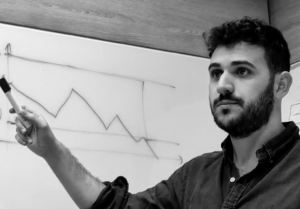

I have been always fascinated by technology and computers, since I was child. I studied my Bachelor’s Degree and Master’s Degree in Telecommunications Engineering, focusing myself mainly on telematics, network architecture and systems architecture. In the meantime I destroyed several OSs by playing with the linux kernel (the bright side is that I learned how to restore and fix them😅). I also maintained some services on top of several hosting and server providers as well as AWS, just for the very sake of it (and to earn a little bit of money).

  

Some other projects include an IDS with several Raspberri Pis and routers with OpenWRT, and a “micro-datacenter” using intel NUCs as a playground for VMWare and k8s (shared with a friend). Furthermore, I have programmed in many different languages from simple scripting and automation with bash and python, to remote drone controlling or .pcap captures processing with C. The common point of all these activities has been always the same: learning new stuff.

Curiosity is what keeps me moving forward, trying new technologies, architectures and paradigms as well as understanding the current and upcoming trends in the IT world.

Currently, I am a member of the Platform team at Sennder, a German freight-forwarder startup whose main focus is logistics optimization, and which has grown exponentially during the last year. The platform team provides the CI/CD infrastructure for the developers as well guidance for them to bootstrap their own cloud-native infrastructure.

Before joining Sennder, I was in charge of the architecture, maintenance and evolution of a cloud native (kubernetes-based) CI/CD platform as well as its integration with external services, alongside the colleagues of the DevOps Excellence Center at Orange Spain.

Before that, I was part of the PaaS team in a joint venture between Santander Globaltech and IBM, which was in focused on implementing and managing the On Premises and public cloud infrastructure to support hybrid applications.

Prior to that, I was a member of the 5G Mobile Laboratory of the CTU in Prague, where I worked while I was developing my Master Thesis. During this time I focused myself on mobile network virtualization by using edge computing, virtual machines and container based solutions. By breaking down network functions into smaller units and offloading computational load, we end up with an operational flying 4G antenna (a drone).

⎈☁️👨🏽‍💻Stay curious, never stop learning!👨🏽‍💻☁️⎈

If you want to know a little bit more about my background check my <a href="https://www.linkedin.com/in/miguel-fontanilla-14114710b/" target="_blank" rel="noopener">LinkedIn profile</a>